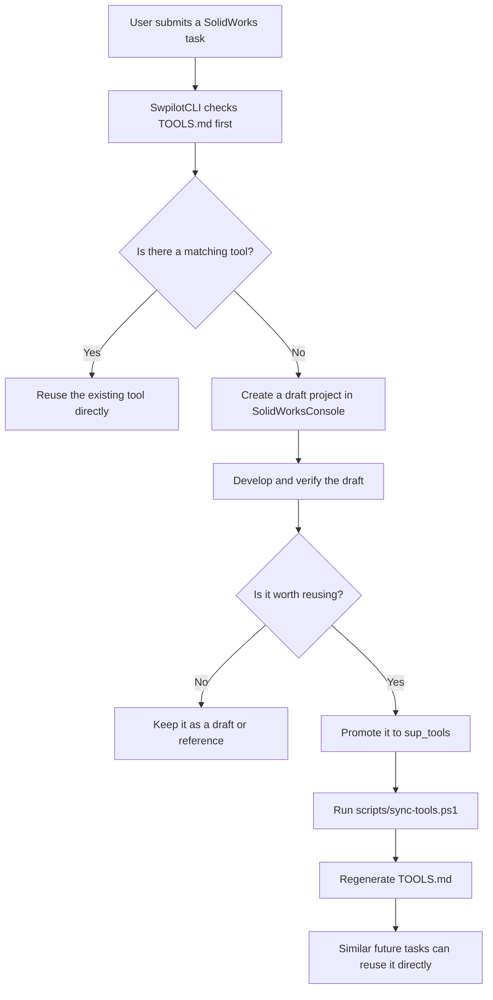

# SwpilotCLI - An All-in-One AI-Powered SolidWorks Plugin

<p>
  
  
  
  
  
  
</p>

<p align="center">
  <strong>If SwpilotCLI helps you, consider supporting its development:</strong>
</p>

<p align="center">
  <a href="https://swapi-pilot.lemonsqueezy.com/checkout/buy/32e55278-7c59-4b11-87cb-44fc66273701">
    
  </a>
</p>

I originally named it "Pilot" because I thought it would only assist with operating SolidWorks.

After finishing the project, I realized it can do far more than assistance. In some workflows, it can even replace a coworker.

It is more like:

**A SolidWorks engineer that can complete work independently.**

The SwpilotCLI workflow is simple:

1. Describe your SolidWorks task, and SwpilotCLI creates a Tool automatically.
2. After the task is complete, promote it to `sup_tools`, and SwpilotCLI installs the Tool.
3. Reuse the learned Tool, and SwpilotCLI executes it directly.

---

## Demo Videos

### 1. SwpilotCLI：Drop in a hand-drawn sketch and AI instantly generates a SolidWorks part

[](https://youtu.be/NmeGahaNNik)

```text
prompt:
Convert the engineering drawing in the image into a SolidWorks part.
I’ve already opened a new part file. Please create it directly there.
Use logical inference to determine any unclear dimensions,
and complete it without asking me further questions.
```

### 2. SwpilotCLI：Natural Language to SolidWorks Macro

[](https://youtu.be/W1-Z9c_huSo)

```text
prompt:
Write a program that, when executed, sets the material of all SolidWorks part files in "D:\Del3" to "6061".
```

### 3. SwpilotCLI：Let AI organize your SolidWorks files automatically

[](https://youtu.be/DzMBnQK84f4)

```text
prompt:
Open the SolidWorks files in "D:\Del4" and classify them.
Move screws into the "Screws" folder and nuts into the "Nuts" folder.
Create the folders if they do not already exist.
```

---

## Installation

### Requirements

1. Your computer must have Claude Code CLI, Codex CLI, or another AI model for CLI that can run from CMD.
2. I recommend turning off sandbox mode, because it can easily cause execution errors.
3. Your computer must have SolidWorks installed.

In short:

- Claude Code Pro(pro$20)
- Codex Pro(pro$20)
- SolidWorks($?)

### Installation Steps

1. Download SwpilotCLI.
2. Put the SwpilotCLI folder in the path where you want to install it. I recommend `C:\SwpilotCLI`.
3. Run the CLI inside the SwpilotCLI folder, then enter:

```text
prompt:
Install SwpilotCLI following Install.md.
Do not ask questions; make reasonable assumptions and continue.
Use the newest installed SOLIDWORKS version.
Build, copy dependencies, register the add-in, configure Codex MCP, and verify the result.
```

4. Wait for the installation to complete.

### Installation Demo Video

[](https://youtu.be/emlcr3aU6Zs)

### What the Installation Configures

1. SwpilotCLI add-in main component.
2. Copies the local SolidWorks dependency DLLs to the installation source.
3. .NET 8 SDK.
4. .NET Framework Developer Pack.
5. Codex MCP configuration, or Claude MCP configuration.
6. PowerShell execution policy.

MCP configuration:

- Name: `swapi-pilot`
- URL: `https://swapi-pilot.com/mcp`

### Codex API-key authentication

This fork defaults the task pane to Codex; the original Claude option remains
available in the tool selector.
Codex CLI can use either a ChatGPT login or an OpenAI API key. To switch the local
Codex CLI to API-key authentication without storing the key in this repository, run:

```powershell
.\scripts\configure-codex-api.ps1
```

The script reads the key as hidden input and passes it to `codex login --with-api-key`
through standard input.

---

## Interface Overview


The reason SwpilotCLI can control SolidWorks so well is that it uses `swapi-pilot-solidworks-mcp` to query the SolidWorks API.

When I first designed `swapi-pilot-solidworks-mcp`, I thought many people would use it. Later I realized that very few people write SolidWorks API code, so that MCP project only serves a small audience.

I did not want that work to stop there, so I used `swapi-pilot-solidworks-mcp` as the foundation and built SwpilotCLI for a broader audience.

That said, because Claude CLI and Codex CLI both require paid subscriptions, I do not expect SwpilotCLI to attract a huge audience either... Q_Q

`swapi-pilot-solidworks-mcp` project:

https://github.com/arthurle3210/swapi-pilot-solidworks-mcp

---

## Tool Creation Example: sup_tools Workflow

If you're using Codex CLI, make sure to set approvals to Full Access and permissions to Full Access.

Otherwise, it may run in sandbox mode, which can cause long delays or make the process hang.

[](https://youtu.be/DVSn7tBQjfk)

```text
prompt:
Draw a 40x40x10 cube.
Create a 10 mm hole at the center.
Automatically apply a 0.5 C x 45 degree chamfer to the center hole.
Then open "D:\Del3\part5.SLDPRT" and when you see the round hole, apply a 0.5 C x 45 degree chamfer.
Review SolidWorksConsole and identify which parts can be moved to sup_tools, and which parts can be deleted.
Do as you suggested: delete what should be deleted, and move what should be moved to sup_tools.

Confirm the following:
TOOLS.md has been regenerated by sync-tools.ps1.
```

Please remember:

## After every completed task, ask SwpilotCLI to promote it to sup_tools

The skills you train will become the tools best suited to your own workflow. You must promote them to `sup_tools`.

That is how SwpilotCLI can find the right tool directly from `sup_tools` the next time you use it.

If you do not promote the result to `sup_tools`, SwpilotCLI may rewrite the same code again next time. That is not the intended way to use SwpilotCLI.

---

## General users can start using SwpilotCLI from here

The sections below are for developers. General users can skip them.

---

## Open Code

All tools generated by SwpilotCLI are Open Code. The code is visible, controllable, and extensible.

`SolidWorksConsole` and `sup_tools` contain C# code. You can also use SwpilotCLI itself to help you write code.

---

## Vision System

SwpilotCLI can see the SolidWorks screen, so it can help inspect models and drawings.

From writing code to verifying results, the AI is not only operating SolidWorks. It can actually understand and validate the result.

---

## Naming Rules

- `swpilotcli-xxxx`: general basic function.
- `swpilotcli-ActionGroup-xxxx`: custom workflow function, usually composed of multiple functions.

---

## TOOLS.md

[`TOOLS.md`](TOOLS.md) lists the Tools that SwpilotCLI can call.

It is generated by `scripts/sync-tools.ps1`. Each time a tool is promoted to `sup_tools`, this file is regenerated.

---

## Deep Dive: SwpilotCLI Tool Training Workflow

The core SwpilotCLI workflow is: reuse existing tools first. Only when no suitable tool exists should SwpilotCLI create a draft project in `SolidWorksConsole`, validate it, decide whether it should be promoted to `sup_tools`, and then regenerate `TOOLS.md`. This lets similar future tasks directly reuse the existing tool.

### Workflow Diagram



### Standard Workflow

1. The user submits a SolidWorks task.
2. SwpilotCLI checks `TOOLS.md` first.
3. If a matching tool already exists, SwpilotCLI reuses it directly instead of developing a new one.
4. If no matching tool exists, SwpilotCLI creates a draft project in `SolidWorksConsole`.
5. The draft is developed and verified in that directory.
6. If the capability has long-term reuse value, it is promoted to `sup_tools`.
7. After promotion, run `scripts/sync-tools.ps1` to regenerate `TOOLS.md`.
8. When a similar task appears later, SwpilotCLI can find and reuse that tool from `TOOLS.md`.

### Directory Roles

| Directory / File | Role |
| --- | --- |
| `SolidWorksConsole` | Draft development and verification area |
| `sup_tools` | Official reusable tools area |
| `TOOLS.md` | Automatically generated tool index |

### Notes

- `TOOLS.md` should not be edited manually.
- `TOOLS.md` is regenerated by scanning `main_tools` and `sup_tools`.
- Not every draft needs to be promoted to `sup_tools`.
- The value of this workflow is accumulation: each official tool makes similar future tasks faster.

---

## License

See [LICENSE](LICENSE).

---

[繁體中文](README.zh-TW.md)
